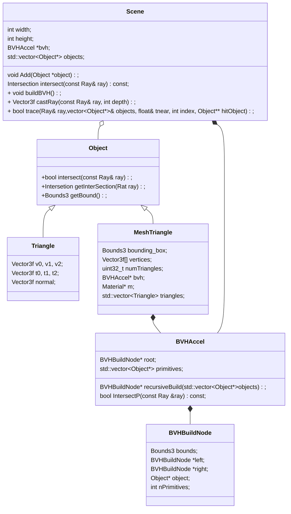

```c++
BVHBuildNode* BVHAccel::recursiveBuild(std::vector<Object*> objects)
{
    // 创建返回的BVHBuildNode
    
    // 求出objects的boundingbox
    
    // 只有一个object
    // bounds等于object的Bounds
    
    // 有两个object
    // 用两个object分别构建left和right node，递归调用recursiveBuild
    // bounds等于左右两个子树bounds的Union
    
    // 有三个或以上object
    // 找出最长的轴，并将所有object用最长轴的坐标大小排序
    // 从中点一分为二递归调用recursiveBuild,分别构建左右子树
    // bounds等于左右两个子树bounds的Union
}

int main()
{
    MeshTriangle();
    {
        // 加载模型
        
        //每三个顶点组成一个三角形，添加到Objects数组中，并用这个数组构建BVH树
        
        //计算整个模型的boundingbox
    }
    
   	// 将MeshTriangle添加到scene的object数组中，且用此数组构建bvh
    // 
}

Vector3f Scene::castRay(const Ray &ray, int depth) const
{
    Intersection intersection = Scene::intersect(ray);
    {
        //this->bvh->Intersect(ray); 展开后
        Intersection BVHAccel::Intersect(const Ray& ray) const
        {
            Intersection BVHAccel::getIntersection(BVHBuildNode* node, const Ray& ray) const
            {
                
            }
        }
    }
}
```

